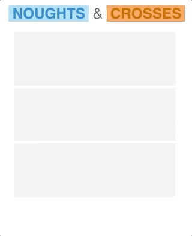

# `Rust` + `React` = `❤️`

## WebAssembly Example

- `Rust` tic-tac-toe (Noughts & Crosses) engine, compiled to `WebAssembly`
- `React` UI

## Gameplay



CSS [found here](https://codepen.io/coreydunkin/pen/zqrud) and is `(c)` by original author

Code `(c)` 2018-2020 Art Deineka, [darkest_ruby](https://twitter.com/darkest_ruby)

## Docker image

```
$ docker build -t tictactoe .
$ docker run -d -it --rm --name tictactoe -p 6789:6789 tictactoe
```
